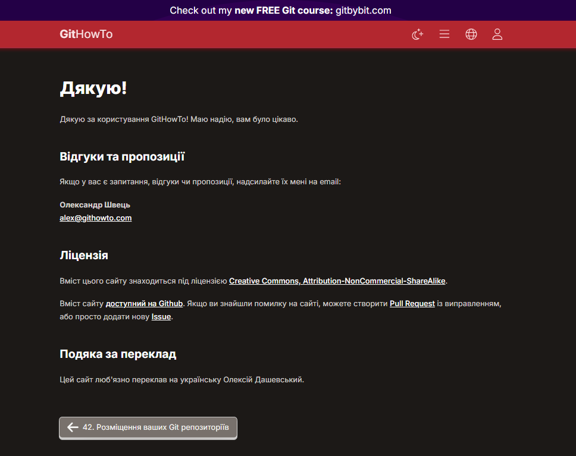

# Звіт про проходження курсу "Git How To"

## Виконане завдання

Я пройшов інтерактивний курс [Git How To](https://githowto.com/uk), що охоплює основи роботи з системою контролю версій Git. Курс був поділений на дві частини:

### Частина 1 (обов’язкова):
Пройдено повністю. Включає:
- ініціалізацію репозиторію (`git init`);
- додавання файлів до індексу (`git add`);
- створення комітів (`git commit`);
- перегляд історії (`git log`);
- скасування змін (`git reset`, `git checkout`);
- створення та перемикання між гілками (`git branch`, `git checkout`).

### Частина 2 (розширений рівень):
Також пройдено повністю. Охоплює:
- злиття гілок (`git merge`);
- вирішення конфліктів під час злиття;
- роботу з тегами (`git tag`);
- взаємодію з віддаленим репозиторієм (`git remote`, `git push`, `git fetch`, `git pull`).

## 📎 Додатки

До звіту додаються скріншоти, що підтверджують успішне проходження кожного кроку курсу.

---
**Статус виконання:** Частина 1 + Частина 2 завершені.

## 📸 Скріншоти проходження

**Підтвердження проходження курсу**

Скріншоти поєтапного проходженя зібрані у двох частинах:

### 🔹 Частина I (Завдання 1–29)

| № | Завдання | Перегляд |
|--:|:----------|:---------|
| 1 | Повна готовність до роботи з Git. | [📷Скрін 1](screenshots/part1/1/Screenshot_1.png) |
| 2 | Створення проєкту | [📷Скрін 1](screenshots/part1/2/Screenshot_1.png) [📷Скрін 2](screenshots/part1/2/Screenshot_2.png) [📷Скрін 3](screenshots/part1/2/Screenshot_3.png) [📷Скрін 4](screenshots/part1/2/Screenshot_4.png)|
| 3 | Перевірка стану | [📷Скрін 1](screenshots/part1/3/Screenshot_1.png) |
| 4 | Внесення змін | [📷Скрін 1](screenshots/part1/4/Screenshot_1.png) |
| 5 | Індексація змін | [📷Скрін 1](screenshots/part1/5/Screenshot_1.png) |
| 6 | Індексація та коміт | [📷Скрін 1](screenshots/part1/6/Screenshot_1.png) |
| 7 | Коміт змін | [📷Скрін 1](screenshots/part1/7/Screenshot_1.png) [📷Скрін 2](screenshots/part1/7/Screenshot_2.png)|
| 8 | Зміни, а не файли | [📷Скрін 1](screenshots/part1/8/Screenshot_1.png) [📷Скрін 2](screenshots/part1/8/Screenshot_2.png) [📷Скрін 3](screenshots/part1/8/Screenshot_3.png) [📷Скрін 4](screenshots/part1/8/Screenshot_4.png) [📷Скрін 5](screenshots/part1/8/Screenshot_5.png) |
| 9 | Історія проєкту | [📷Скрін 1](screenshots/part1/9/Screenshot_1.png) [📷Скрін 2](screenshots/part1/9/Screenshot_2.png) [📷Скрін 3](screenshots/part1/9/Screenshot_3.png) [📷Скрін 4](screenshots/part1/9/Screenshot_4.png) |
| 10 | Отримання старих версій | [📷Скрін 1](screenshots/part1/10/Screenshot_1.png) [📷Скрін 2](screenshots/part1/10/Screenshot_2.png) |
| 11 | Створення тегів версій | [📷Скрін 1](screenshots/part1/11/Screenshot_1.png) [📷Скрін 2](screenshots/part1/11/Screenshot_2.png) [📷Скрін 3](screenshots/part1/11/Screenshot_3.png) [📷Скрін 4](screenshots/part1/11/Screenshot_4.png) [📷Скрін 5](screenshots/part1/11/Screenshot_5.png)|
| 12 | Скасування локальних змін (до індексації) | [📷Скрін 1](screenshots/part1/12/Screenshot_1.png) [📷Скрін 2](screenshots/part1/12/Screenshot_2.png) |
| 13 | Скасування проіндексованих змін (перед комітом) | [📷Скрін 1](screenshots/part1/13/Screenshot_1.png) [📷Скрін 2](screenshots/part1/13/Screenshot_2.png) |
| 14 | Скасування комітів | [📷Скрін 1](screenshots/part1/14/Screenshot_1.png) [📷Скрін 2](screenshots/part1/14/Screenshot_2.png) |
| 15 | Видалення комітів з гілки (revert) | [📷Скрін 1](screenshots/part1/15/Screenshot_1.png) [📷Скрін 2](screenshots/part1/15/Screenshot_2.png) |
| 16 | Видалення тегу oops | [📷Скрін 1](screenshots/part1/16/Screenshot_1.png) |
| 17 | Внесення змін до комітів | [📷Скрін 1](screenshots/part1/17/Screenshot_1.png) [📷Скрін 2](screenshots/part1/17/Screenshot_2.png) |
| 18 | Створення гілки | [📷Скрін 1](screenshots/part1/18/Screenshot_1.png) [📷Скрін 2](screenshots/part1/18/Screenshot_2.png) [📷Скрін 3](screenshots/part1/18/Screenshot_3.png) |
| 19 | Перемикання гілок | [📷Скрін 1](screenshots/part1/19/Screenshot_1.png) [📷Скрін 2](screenshots/part1/19/Screenshot_2.png) [📷Скрін 3](screenshots/part1/19/Screenshot_3.png) |
| 20 | Переміщення файлів | [📷Скрін 1](screenshots/part1/20/Screenshot_1.png) [📷Скрін 2](screenshots/part1/20/Screenshot_2.png) [📷Скрін 3](screenshots/part1/20/Screenshot_3.png) [📷Скрін 4](screenshots/part1/20/Screenshot_4.png) [📷Скрін 5](screenshots/part1/20/Screenshot_5.png) |
| 21 | Зміни в гілці main | [📷Скрін 1](screenshots/part1/21/Screenshot_1.png) |
| 22 | Перегляд розбіжних гілок | [📷Скрін 1](screenshots/part1/22/Screenshot_1.png) |
| 23 | Злиття | [📷Скрін 1](screenshots/part1/23/Screenshot_1.png) |
| 24 | Створення конфлікту | [📷Скрін 1](screenshots/part1/24/Screenshot_1.png) [📷Скрін 2](screenshots/part1/24/Screenshot_2.png) |
| 25 | Вирішення конфліктів | [📷Скрін 1](screenshots/part1/25/Screenshot_1.png) [📷Скрін 2](screenshots/part1/25/Screenshot_2.png) [📷Скрін 3](screenshots/part1/25/Screenshot_3.png) |
| 26 | rebase проти merge | Без скріншотів тільки "Обговорення" |
| 27 | Відкочування гілки style | [📷Скрін 1](screenshots/part1/27/Screenshot_1.png) [📷Скрін 2](screenshots/part1/27/Screenshot_2.png) |
| 28 | Перебазування | [📷Скрін 1](screenshots/part1/28/Screenshot_1.png) [📷Скрін 2](screenshots/part1/28/Screenshot_2.png) [📷Скрін 3](screenshots/part1/28/Screenshot_3.png) |
| 29 | Злиття в гілку main | [📷Скрін 1](screenshots/part1/29/Screenshot_1.png) |

### 🔹 Частина II (Завдання 30–42)

| №  | Завдання | Перегляд |
|---:|:---------|:---------|
| 30 | Клонування репозиторіїв | [📷Скрін 1](screenshots/part2/30/Screenshot_1.png) [📷Скрін 2](screenshots/part2/30/Screenshot_2.png) [📷Скрін 3](screenshots/part2/30/Screenshot_3.png) |
| 31 | Перегляд клонованого репозиторія | [📷Скрін 1](screenshots/part2/31/Screenshot_1.png) |
| 32 | Що таке origin?! | [📷Скрін 1](screenshots/part2/32/Screenshot_1.png) |
| 33 | Віддалені гілки | [📷Скрін 1](screenshots/part2/33/Screenshot_1.png) |
| 34 | Зміна оригінального репозиторія | [📷Скрін 1](screenshots/part2/34/Screenshot_1.png) |
| 35 | Підтягування змін | [📷Скрін 1](screenshots/part2/35/Screenshot_1.png) [📷Скрін 2](screenshots/part2/35/Screenshot_2.png) |
| 36 | Злиття підтягнутих змін | [📷Скрін 1](screenshots/part2/36/Screenshot_1.png) [📷Скрін 2](screenshots/part2/36/Screenshot_2.png) |
| 37 | Додавання гілки відстеження | [📷Скрін 1](screenshots/part2/37/Screenshot_1.png) |
| 38 | Чисті репозиторії | [📷Скрін 1](screenshots/part2/38/Screenshot_1.png) |
| 39 | Додавання віддаленого репозиторія | [📷Скрін 1](screenshots/part2/39/Screenshot_1.png) |
| 40 | Відправка змін | [📷Скрін 1](screenshots/part2/40/Screenshot_1.png) |
| 41 | Підтягування спільних змін | [📷Скрін 1](screenshots/part2/41/Screenshot_1.png) |
| 42 | Розміщення Git репозиторіїв | [📷Скрін 1](screenshots/part2/42/Screenshot_1.png) [📷Скрін 2](screenshots/part2/42/Screenshot_2.png) |

## Коментарі та враження

Курс виявився дуже зручним і практичним — він дозволяє одразу застосовувати команди в інтерактивному середовищі, що значно полегшує засвоєння матеріалу. Сподобалось, що кожне завдання має коротке, але чітке пояснення. Також корисною виявилась можливість бачити стан репозиторію після кожного кроку, що допомогло краще зрозуміти, як працює Git "під капотом".

Особливо цікаво було працювати з вирішенням конфліктів під час злиття — це показує реальні ситуації, які виникають при командній роботі.
